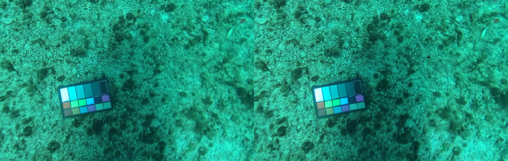
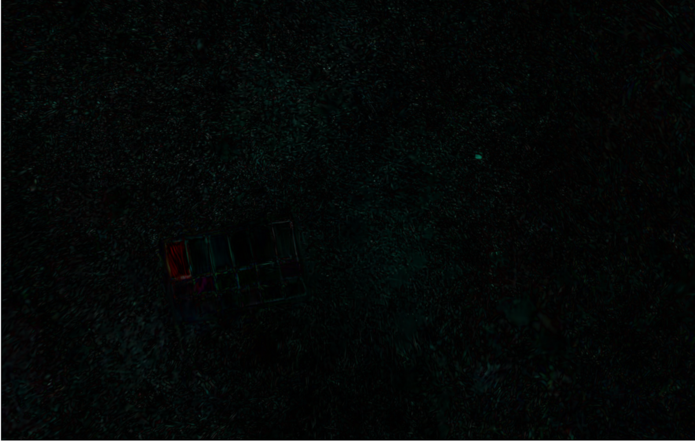
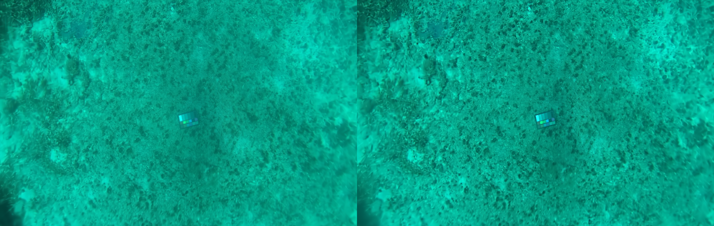
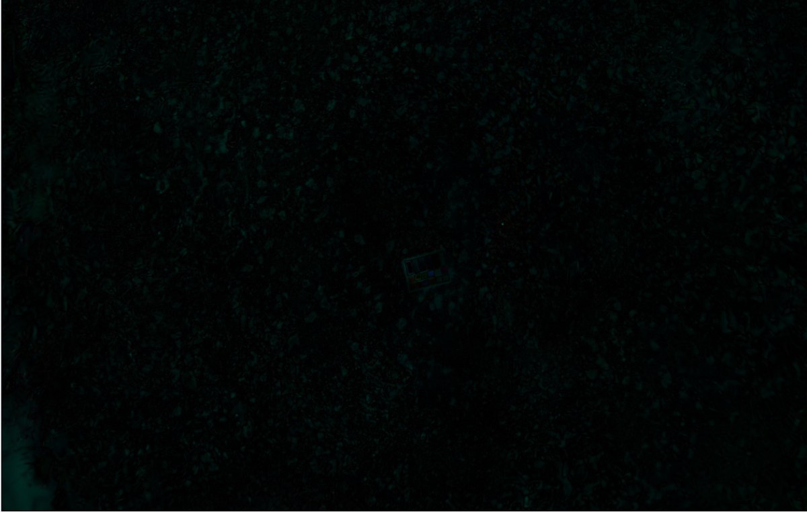
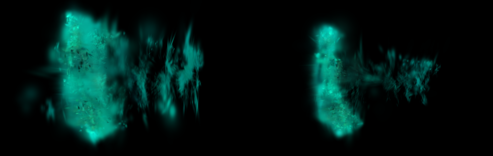
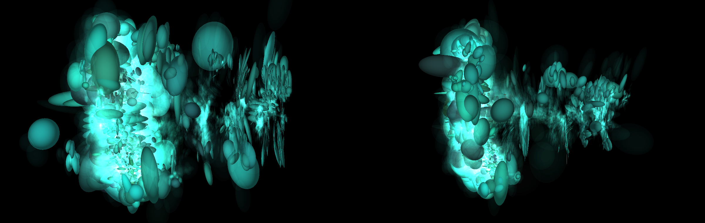

# Removing Transient Distractors from 3D Gaussian Splat Scenes
Based on minor modifications to the T-3DGS repository by Vadim Pryadilshchikov, Alexander Markin, Artem Komarichev, Ruslan Rakhimov, Peter Wonka, and Evgeny Burnaev.
## Brief Discussion of 3D Gaussian Splatting
3D Gaussian Splatting is a novel rendering technique for synthesizing photorealistic 3D scenes from captured data such as multi-view images or videos.  It attempts to supercede Neural Radiance Fields (NeRFs) by offering significantly faster (often realtime) rendering speed, as well as superior image quality in many cases.
### Introduction to the Rendering Method
Unlike traditional mesh-based (rasterization) or NURB-based (raytracing) object representations for rendering, Gaussian splatting uses a collection of 3D Gaussian functions (anisotropic ellipsoids) positioned in space to approximate scene geometry and appearance.  Each Gaussian (known henceforth as a "splat") has attributes like position, orientation, scale, opacity, and color. During rendering, these splats are projected onto the image plane and blended in screen space using alpha compositing.  Because Gaussians are continuous and differentiable, gradient-based optimization can be used to derive representative splats from a series of input images, making them highly suitable for view-synthesis.
More specifically, the original process of producing a Gaussian splat scene is as follows:
1. Obtain input data, consisting of images of a scene (typically photographs; ideally from many scene-encompassing viewpoints for optimal quality).
2. Produce a 3D sparse point cloud via structure from motion (SfM).  The original Gaussian splatting paper uses COLMAP for this task, pulling data from the Photo Tourism dataset.
3. Randomly initialize splats at each of the aforementioned points, parameterized with a position vector, scale vector and quaternion per splat (which replaces the need to optimize the covariance matrix directly which would otherwise difficult due to the nature of such matrices requiring positivity and semi-definiteness).
4. Use stochastic gradient descent to optimize the parameters of each splat to approach consistency with the input images.
Once scene data has been produced from these steps, the splats can be used as primitives to be rasterized efficiently on the GPU using a typical alpha blending algorithm to account for their varying opacity.
### Gradient Optimization
Gradient optimization methods are used to generate the scene.  Each gaussian splat is parameterized with spatial attributes, and then they are optimized directly using any implementation of gradient descent, minimizing photometric loss between the rendering image and the ground truths (input images or video frames).  Convergence can be sped up in a variety of ways:
- Instead of using random initialization, initialize the gaussians using sparse structure-from-motion points.
- Iteratively optimize using SGD (if using smart initialization) or ADAM.
- Adaptively prune low-opacity or extremely thin gaussians.
Training on objects with sparse images or room-sized scenes with videos typically takes several minutes (as tested with 7000 iterations on NVIDIA 4070), whereas larger scenes can take hours or longer, but once optimization is complete, rendering can be performed in real-time (60 fps).
### Gaussian Splatting Extensions
The baseline for Gaussian splatting has been improved upon in a variety of ways, including 2D Gaussian splatting, which is a method that proposes placing surface-normal-aligned 2-dimensional ellipses into the scene instead of 3D splats, resulting in higher geometric accuracy and less noise, as well as significantly faster scene reconstruction speeds.  Additionally, purely anisotropic ellipsoidal Gaussians have been replaced by isotropic spheres (improving efficiency) as well as deformable kernels (improving accuracy with higher edge clarity).  Visual quality can be further improved by adding individual static texture information to each splat, either by embedding pixel colors themselves, or by indexing into a texture atlas built while optimizing, at the cost of some rendering efficiency.
## T-3DGS
### Overview
T-3DGS (transient 3D Gaussian splatting) is an extension to the typical Gaussian splatting algorithm that accounts for transient material (any objects that drastically change positions between input frames) by masking it out of the optimization process, allowing for easier convergence and cleaner renders from in-the-wild data.
### Method Steps
1. Input frames of a video, along with corresponding camera extrinsics.
	- It is assumed that the camera extrinsics are known due to being recorded at the time of recording the video, but it is also possible to use SLAM to estimate the extrinsics.
2. Train a standard 3D Gaussian Splat scene (ignoring transient distractors).
	- During training, track each gaussian's characteristics temporally and feed the data to a light-weight multi-layer perceptron model to predict if they are transient or static.
	- Then, work backwards from the predicted transient gaussians to determine which pixels in the original images produced them, creating rough masks.
3. Refine the masks.
	- T-3DGS uses an edited version of Meta's zero-shot SAM model to refine the initial rough masks of transient objects in each of the input frames both spatially and temporally.
	- Masks that are too large are assumed to be outliers and are ignored, but masks that are too small are kept, because outliers will minimally impact the final result (due to so much overlapping data from the input frames) while also serving to potentially reduce some of the "floaters" that gaussian splatted scenes typically contain.
4. Retrain the scene using the new inputs with refined masks, removing transient objects from the scene while also improving convergence.
## Experiment
### Hypothesis
The purpose of removing transient material from a Gaussian splat scene is for when input data is "from the wild," in that the environment is unable to be controlled, allowing for said transient objects to appear.  Along this same line of thinking, a scene shot through an occlusive medium, like murky water, should yield clearer results by masking out any Gaussians contributing to the medium.
## Results
To test the hypothesis, two models were trained—one baseline and one without transient distractors—on the [SaltPond](https://drive.google.com/file/d/1gItZkfEFmXZzIRh5b6wXeWD6GappX-QN/view) dataset, originally created to test tone reproduction in NeRF renders with underwater photos taken near the US Virgin Islands.
As can be seen in the images below, both models generate scenes without distractors with imperceptable differences, likely only caused by differences in random initialization of the Gaussians.  The left side shows the baseline model, and the right side shows the model without transient distractors.  The second image shows an image diff.

However, for a scene with distractors (a farther away shot with more detritus in the water between the camera and the seafloor), the image appears less blurry.  Again, the left side shows the baseline model, the right side shows the model without transient distractors, and the second image shows a diff between the two model images.

This visual intuition can be explained by looking at the generated Gaussians from a new angle.  The images below compare the two models from a side-view slice of the scene.  The first image displays the Gaussians in their natural state, and the second draws each splat as a solid ellipsoid to better show the positions and sizes of each splat.  Given that the seafloor is the only permanent object in the scene, one would expect a perfect render to include only the bulk of the Gaussians on the left side, encoding the water color into them via spherical harmonics, and removing any other Gaussians as transient distractors.  While the results do not demonstrate this perfect render, there is a clear decrease in transient Gaussians, especially along the edges of the input images (shown by the decrease in Gaussians at the top and bottom of the side view).

This removal of Gaussians supports the hypothesis that the masking process can be used to more accurately render underwater images; however, the perfect render remains out of reach, likely requiring a more bespoke approach than using a zero-shot model to predict mask boundaries.
## Additional Information
### Installation on Windows
1. Download the repository.
2. Install miniconda.
3. Open the conda terminal and install the environment requirements from `environment.yml`.
4. Install OpenCV via CMake (not with the Windows library installation pack).
5. Install SIBR_Viewer with a path to the OpenCV installation (via `-DOpenCV_DIR`). 
### Training & Testing
- Train with `python train.py -s path/to/dataset -r 4 --iterations 7000`.  Use `--disable_transient --disable_dilate --lambda_tv 0` to disable transient masking.
- Test with `python metrics.py -m path/to/model`.
- Render with `.\SIBR_gaussianViewer_app.exe --model-path path/to/model`.